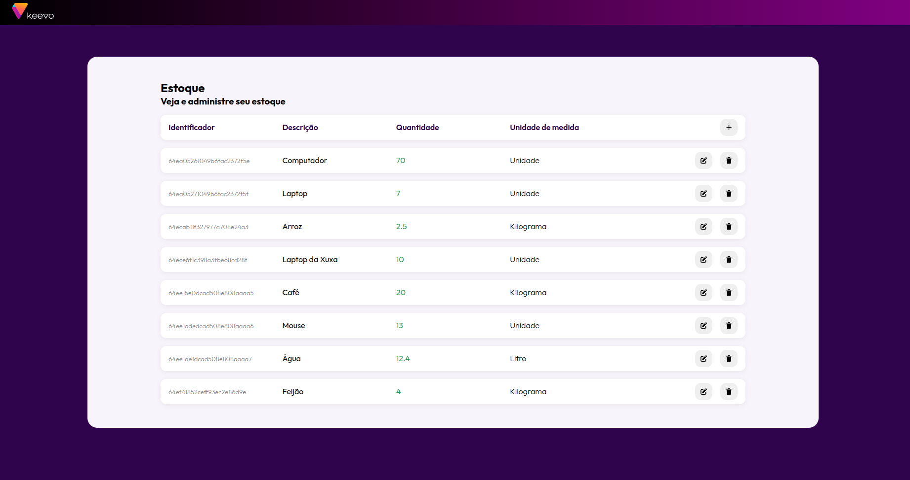

# Inventory Control System

The Inventory Control System is a robust application designed to streamline the management of inventory items. Each item in the inventory is defined by attributes such as an identifier, description, quantity, and measure unit. This system allows users to create new items, edit existing items, and delete items, all while ensuring error-free data input.



## Features

<p align="center">
  <a href="https://skillicons.dev">
    
  </a>
</p>

- **Item Management:** Create, edit, and delete inventory items with ease.
- **Data Validation:** Robust error handling ensures that only valid attributes are accepted.
- **Database with MongoDB:** Utilizes MongoDB as the database system to securely store and manage inventory data.
- **Docker Container:** Runs MongoDB within a Docker container, providing a consistent and isolated environment.
- **Backend (Node.js, TypeScript):** Utilizes TypeScript and Node.js to provide a reliable and performant server.
- **Frontend (Angular):** The Angular frontend offers an intuitive and user-friendly interface for interacting with the inventory.

## Architecture

The Inventory Control System employs a well-structured architecture:

### Backend (Node.js, TypeScript):

- **Controllers:** Handle incoming HTTP requests and manage the flow of data between the frontend and the database.
- **Repositories:** Interact with the database, abstracting complex database operations to ensure data integrity.
  Routes: Define API endpoints, specifying which controller methods to invoke for each endpoint.

### Frontend (Angular):

- **User Interface:** Provides a clean and intuitive interface for managing inventory items.
- **API Integration:** Communicates with the backend API to perform CRUD (Create, Read, Update, Delete) operations on inventory items.

## Getting Started

To run the Inventory Control System locally, follow these steps:

### Clone the Repository:

```shell
git clone https://github.com/Chbmleao/InventoryControl-KeevoTec.git
cd keevotec-inventory-control
```

### Backend Setup:

- Navigate to the backend directory.

- Install dependencies using yarn:

```shell
cd backend
yarn
```

- Create a .env file in the backend directory with the following structure:

```dotenv
PORT=8000

MONGODB_URL=mongodb://localhost:27017
MONGODB_USERNAME=root
MONGODB_PASSWORD=password
```

- Replace mongodb://localhost:27017, root, and password with your MongoDB configuration.

### Frontend Setup:

- Make sure you have Angular CLI installed globally. If not, you can install it with:

```shell
npm install -g @angular/cli
```

- Navigate to the frontend directory.

- Install dependencies using npm:

```shell
cd frontend
npm install
```

### Start the Application:

- Start the docker container:

```shell
docker compose up -d
```

- Start the backend server:

```shell
cd backend
yarn start:dev
```

- Start the Angular frontend:

```shell
cd frontend
ng serve
```

### Access the Application:

- Open your web browser and access the application at `http://localhost:4200`
